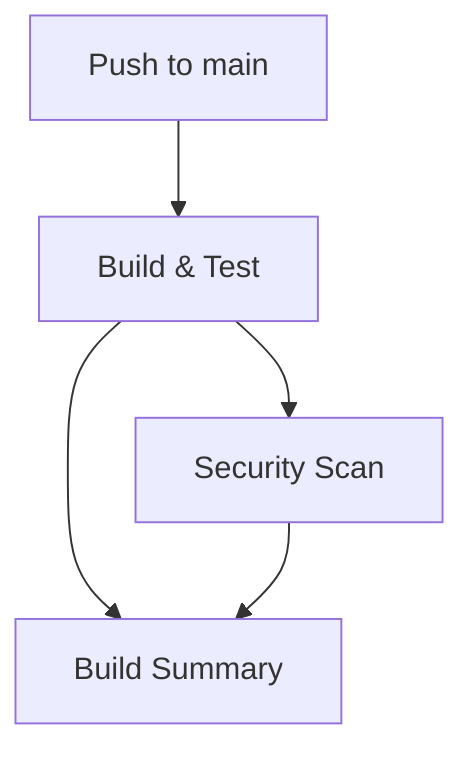
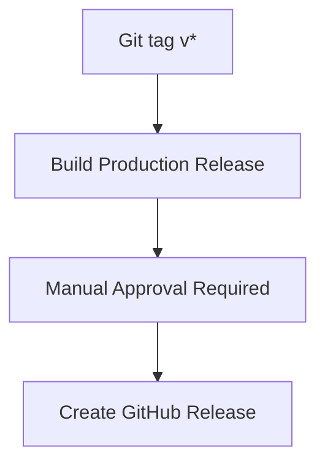

# 🚀 AutoGen DekuDeals - GitHub Repository Setup

Step-by-step guide to set up **GitHub repository** with **CI/CD pipelines** for AutoGen DekuDeals.

## 📋 Prerequisites

- ✅ **GitHub account** - [github.com](https://github.com)
- ✅ **Git installed** - `git --version`
- ✅ **Local project ready** - AutoGen DekuDeals with CI/CD files
- ✅ **OpenAI API key** - For testing and production

## 🎯 Quick Setup (15 minutes)

### **Step 1: Create GitHub Repository**

#### **Option A: GitHub Web Interface**
1. Go to [github.com](https://github.com)
2. Click **"New repository"** (green button)
3. Fill in details:
   - **Repository name:** `autogen-dekudeals`
   - **Description:** `🎮 Enterprise-level game analysis with AutoGen agents`
   - **Visibility:** Public (recommended) or Private
   - **Initialize:** ❌ Don't add README, .gitignore, or license (we have them)
4. Click **"Create repository"**

#### **Option B: GitHub CLI**
```bash
# Install GitHub CLI if needed
# See: https://cli.github.com/

# Create repository
gh repo create autogen-dekudeals --public --description "🎮 Enterprise-level game analysis with AutoGen agents"
```

### **Step 2: Configure Local Git**

```bash
# Initialize git (if not already done)
git init

# Set main branch
git branch -M main

# Add all files
git add .

# Initial commit
git commit -m "🚀 Initial commit with CI/CD pipeline"

# Add GitHub remote (replace YOUR_USERNAME)
git remote add origin https://github.com/YOUR_USERNAME/autogen-dekudeals.git

# Push to GitHub
git push -u origin main
```

### **Step 3: Configure Repository Secrets**

Go to your repository on GitHub:
`https://github.com/YOUR_USERNAME/autogen-dekudeals`

1. **Settings** tab → **Secrets and variables** → **Actions**
2. Click **"New repository secret"**
3. Add required secret:

| Name | Value | Description |
|------|-------|-------------|
| `OPENAI_API_KEY` | `sk-your-actual-api-key` | Your OpenAI API key for testing |

**Important:** Use your real OpenAI API key, not a placeholder!

### **Step 4: Set up Production Environment**

1. Go to **Settings** → **Environments**
2. Click **"New environment"**
3. Name: `production`
4. Configure protection rules:
   - ✅ **Required reviewers** - Add yourself
   - ✅ **Wait timer** - 0 minutes (or desired delay)
   - ✅ **Deployment protection rules** - Enable

### **Step 5: Verify CI/CD Setup**

1. Go to **Actions** tab in your repository
2. You should see:
   - ✅ **CI/CD Pipeline** workflow (ran automatically on push)
   - ✅ Green checkmark if successful
   - ❌ Red X if failed (check logs)

## 🧪 Testing Your Setup

### **Test 1: Automatic CI Pipeline**

```bash
# Make a small change
echo "# Test change" >> README.md

# Commit and push
git add README.md
git commit -m "🧪 Test CI pipeline"
git push origin main

# Check GitHub Actions
# Go to: Repository → Actions → Latest workflow run
```

**Expected Result:**
- ✅ Build & Test job passes
- ✅ Security Scan job passes  
- ✅ Build Summary shows success
- ✅ Docker image artifact created

### **Test 2: Production Deployment**

```bash
# Create a production release tag
git tag v6.3.0
git push origin v6.3.0

# Check GitHub Actions
# Go to: Repository → Actions → Production Deployment
```

**Expected Flow:**
1. ✅ **Build Production Release** - Builds Docker image
2. 🚦 **Manual Approval Required** - Waits for your approval
3. ⏳ **Pending** - Shows "Waiting for review"

**To approve:**
1. Go to Actions → Production Deployment workflow
2. Click **"Review pending deployments"**
3. Select **"production"** environment
4. Click **"Approve and deploy"**

**After approval:**
- ✅ **Create GitHub Release** - Automatic release creation
- 📦 **Release assets** - Docker image + documentation
- 🎉 **Deployment complete!**

## 📊 Understanding Your CI/CD Pipeline

### **Automatic Triggers**

| Event | Workflow | Description |
|-------|----------|-------------|
| Push to `main` | CI/CD Pipeline | Build, test, security scan |
| Pull Request | CI/CD Pipeline | Validate changes before merge |
| Tag `v*` | Production Deployment | Production release |
| Manual | Any workflow | Manual trigger option |

### **Workflow Jobs Breakdown**

#### **CI/CD Pipeline (`.github/workflows/ci.yml`)**


**Jobs:**
1. **🔨 Build & Test** - Environment setup, code quality, Docker build, testing
2. **🔒 Security Scan** - Trivy vulnerability scanning
3. **📋 Build Summary** - Results summary and reporting

#### **Production Deployment (`.github/workflows/prod-deploy.yml`)**


**Jobs:**
1. **🔨 Build Production Release** - Production Docker image build
2. **🚦 Manual Approval Required** - Human approval gate
3. **🎉 Create GitHub Release** - Release automation with assets

## 🔧 Advanced Configuration

### **Custom Branch Protection**

Go to **Settings** → **Branches** → **Add rule**

**Recommended settings:**
- ✅ **Require status checks** - Require CI pipeline to pass
- ✅ **Require up-to-date branches** - Before merging
- ✅ **Include administrators** - Apply rules to admins too

### **Notifications Setup**

Go to **Settings** → **Notifications**

**Recommended:**
- ✅ **Actions** - Get notified about workflow failures
- ✅ **Releases** - Get notified about new releases

### **Issue Templates**

Create `.github/ISSUE_TEMPLATE/` directory with templates:

```bash
mkdir -p .github/ISSUE_TEMPLATE

# Bug report template
cat > .github/ISSUE_TEMPLATE/bug_report.md << 'EOF'
---
name: Bug report
about: Create a report to help us improve
title: '[BUG] '
labels: bug
assignees: ''
---

## Bug Description
A clear description of the bug.

## Steps to Reproduce
1. Run command: `...`
2. See error: `...`

## Expected Behavior
What should happen.

## Environment
- OS: [e.g., Ubuntu 22.04]
- Docker version: [e.g., 24.0.0]
- AutoGen DekuDeals version: [e.g., v6.3.0]
EOF
```

### **Pull Request Template**

```bash
cat > .github/PULL_REQUEST_TEMPLATE.md << 'EOF'
## Description
Brief description of changes.

## Type of Change
- [ ] Bug fix
- [ ] New feature
- [ ] Documentation update
- [ ] Performance improvement

## Testing
- [ ] Tests added/updated
- [ ] Manual testing completed
- [ ] CI pipeline passes

## Checklist
- [ ] Code follows project style
- [ ] Self-review completed
- [ ] Documentation updated
EOF
```

## 🎯 Usage Examples

### **Development Workflow**

```bash
# 1. Create feature branch
git checkout -b feature/new-analysis-mode
# Make changes
git add .
git commit -m "✨ Add new analysis mode"
git push origin feature/new-analysis-mode

# 2. Create Pull Request on GitHub
# GitHub will automatically run CI pipeline

# 3. After review and merge to main
# CI pipeline runs automatically

# 4. For production release
git checkout main
git pull origin main
git tag v6.3.1
git push origin v6.3.1
# Manual approval required for production
```

### **Hotfix Workflow**

```bash
# 1. Emergency fix
git checkout -b hotfix/critical-bug
# Make fix
git add .
git commit -m "🐛 Fix critical bug"
git push origin hotfix/critical-bug

# 2. Create Pull Request with label "hotfix"
# 3. Fast-track review and merge
# 4. Immediate production release
git tag v6.3.2
git push origin v6.3.2
```

## 🔒 Security Best Practices

### **Secrets Management**
- ✅ **Never commit secrets** - Use GitHub Secrets
- ✅ **Rotate API keys** - Regularly update OPENAI_API_KEY
- ✅ **Limit secret access** - Only necessary workflows
- ✅ **Audit secret usage** - Monitor in workflow logs

### **Workflow Security**
- ✅ **Pin action versions** - Use specific versions (e.g., `@v4`)
- ✅ **Review dependencies** - Check third-party actions
- ✅ **Limit permissions** - Use minimal required permissions
- ✅ **Protect main branch** - Require pull requests

### **Environment Protection**
- ✅ **Production approval** - Manual review for production
- ✅ **Environment secrets** - Environment-specific secrets
- ✅ **Deployment windows** - Control when deployments happen
- ✅ **Rollback capability** - Plan for rollback scenarios

## 🔧 Troubleshooting

### **Common Issues**

#### **Workflow Not Triggering**
```bash
# Check workflow file syntax
cat .github/workflows/ci.yml

# Check file is committed
git ls-files .github/workflows/

# Check branch protection rules
# GitHub → Settings → Branches
```

#### **Secrets Not Working**
```bash
# Verify secret name exactly matches
# Repository → Settings → Secrets → Actions

# Check workflow uses correct secret name
grep -r OPENAI_API_KEY .github/workflows/

# Test with dummy secret first
```

#### **Docker Build Failing**
```bash
# Test locally first
./scripts/local-build.sh

# Check Dockerfile syntax
docker build . --dry-run

# Review GitHub Actions logs
# Actions → Failed workflow → Job details
```

#### **Approval Gate Not Working**
```bash
# Check environment exists
# Repository → Settings → Environments → production

# Check protection rules enabled
# Required reviewers should include you

# Check workflow references correct environment
grep -r "environment:" .github/workflows/
```

## 📚 Next Steps

After successful GitHub setup:

1. **📖 Documentation** - Update README with GitHub repository links
2. **🔄 Team Setup** - Add collaborators and configure roles
3. **📊 Monitoring** - Set up notifications and status badges
4. **🚀 Production** - Deploy first production release
5. **📈 Analytics** - Monitor usage and performance

## 🎉 Success Checklist

- ✅ **Repository created** and code pushed
- ✅ **Secrets configured** with OpenAI API key
- ✅ **Environment set up** with production protection
- ✅ **CI pipeline works** on every push
- ✅ **Production deployment** with manual approval
- ✅ **GitHub Release** created automatically
- ✅ **Docker image** available in release assets

**Your GitHub CI/CD pipeline is production-ready!** 🚀

## 📞 Support

If you encounter issues:

1. **Check workflow logs** - GitHub Actions provides detailed logs
2. **Test locally first** - Use `./scripts/local-build.sh` and `./scripts/local-deploy.sh`
3. **Review documentation** - [DEPLOYMENT.md](./DEPLOYMENT.md) for complete guide
4. **Create GitHub Issue** - Use issue templates for bug reports

Happy deploying! 🎮 